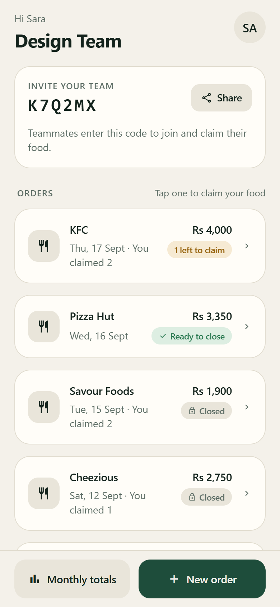
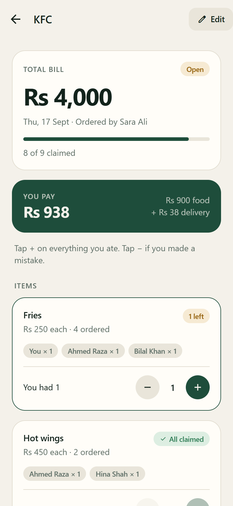
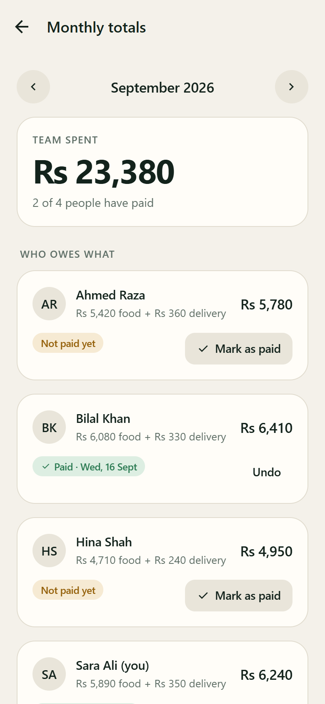
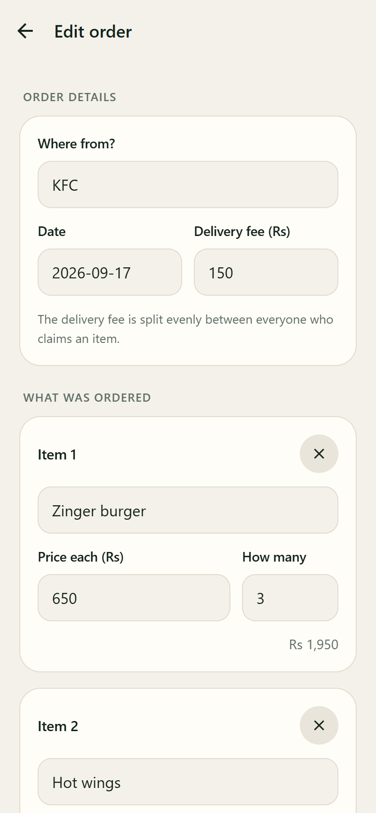
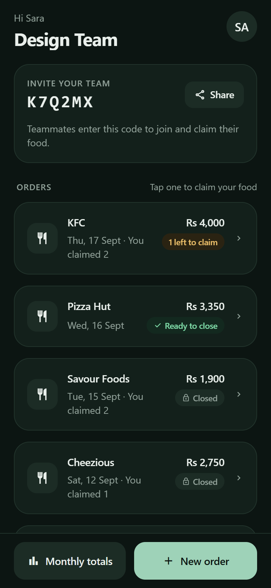
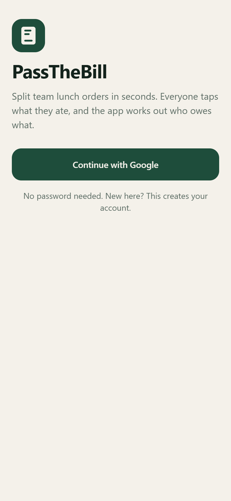

# PassTheBill

**Split team lunch orders without the end-of-month guesswork.**

One person enters the order. Everyone taps what they ate. The app splits the delivery fee, keeps a running tab per person, and shows who owes what at the end of the month.


<table>
  <tr>
    <td align="center"><br /><sub><b>Team orders</b></sub></td>
    <td align="center"><br /><sub><b>Claim what you ate</b></sub></td>
    <td align="center"><br /><sub><b>Monthly totals</b></sub></td>
  </tr>
  <tr>
    <td align="center"><br /><sub><b>Add or edit an order</b></sub></td>
    <td align="center"><br /><sub><b>Dark mode</b></sub></td>
    <td align="center"><br /><sub><b>Google sign-in</b></sub></td>
  </tr>
</table>

<sub>Screenshots show demo data.</sub>

---

## Contents

- [Features](#features)
- [How the money works](#how-the-money-works)
- [Tech stack](#tech-stack)
- [Project structure](#project-structure)
- [Getting started](#getting-started)
- [Push notifications](#push-notifications)
- [Building and releasing](#building-and-releasing)
- [Database](#database)
- [Known limitations](#known-limitations)

## Features

- **Google sign-in.** No passwords, and the same Google account always returns to the same person on any device.
- **Teams by invite code.** Start a team and share its six-character code; teammates enter it to join.
- **One order, many eaters.** The orderer enters each item with its price and quantity, plus the delivery fee.
- **Claim by unit.** If three Zinger burgers were ordered, three people each tap **+** once. You can't claim more than was ordered.
- **Order admin.** The person who created an order sees who claimed what, can leave anyone out of the delivery split, and can add an extra charge to a specific person.
- **Accept or reject extra charges.** The charged person gets a notification and must accept before it counts. Rejecting notifies the creator and keeps the order from closing until the charge is removed.
- **Live updates.** Claims and new orders show up on everyone's phone instantly.
- **Push notifications.** Teammates get a notification when a new order is posted, even if the app is closed. Tapping it opens the order.
- **Close to freeze.** An order can only be closed once every unit is claimed. After that, prices and claims are locked.
- **Monthly totals.** See each person's food and delivery totals for any month, and mark people as paid.
- **Light and dark themes.** Follows the phone's setting, or can be pinned in Settings.
- **Automatic deploys.** Every push to `master` builds the app on EAS and, if the build succeeds, updates every installed copy without a reinstall.

## How the money works

| Rule | Enforced by |
|---|---|
| Each person pays `units claimed × unit price` for their items | `order_member_totals` view |
| Delivery is split equally among the people who claimed at least one item, minus anyone the creator left out | `order_member_totals` view |
| Extra charges count only once the charged person accepts them | `order_member_totals` view, `respond_to_charge()` |
| Nobody can claim more units than were ordered | `claims_units` trigger |
| The orderer can't lower a quantity below what's already claimed | `items_qty` trigger |
| Only the creator can close an order, and only when every unit is claimed, every extra charge is accepted, and someone shares the delivery | `close_order()` function |
| Closed orders can't be edited, re-claimed or deleted | Row-level security |
| Marking people as paid is disabled while the month still has open orders | App |

Money rules live in Postgres, not in the app, so a bug or a modified client can't break them. Amounts are stored unrounded and only rounded for display, so shares always add up to the real bill.

## Tech stack

| Layer | Choice |
|---|---|
| App | [Expo](https://expo.dev) SDK 57, React Native 0.86, React 19, TypeScript |
| Navigation | [Expo Router](https://docs.expo.dev/router/introduction/) with `Stack.Protected` route guards |
| Backend | [Supabase](https://supabase.com): Postgres, row-level security, Realtime, Auth |
| Auth | Google OAuth via Supabase (PKCE) in an in-app browser sheet |
| Push | `expo-notifications` and the Expo Push Service (Firebase Cloud Messaging on Android), sent from Postgres with `pg_net` |
| Builds and updates | EAS Build, EAS Update, GitHub Actions |

## Project structure

```
src/
├── app/                     # Screens (file-based routes)
│   ├── _layout.tsx          # Session loading, route guards, theme, push setup
│   ├── (tabs)/              # Bottom tabs: Orders, Totals, + New order, Settings
│   ├── onboarding.tsx       # First-launch intro
│   ├── sign-in.tsx          # "Continue with Google"
│   ├── auth-callback.tsx    # Finishes Google sign-in when Android routes the redirect here
│   ├── join.tsx             # Join a team by code, or create one
│   ├── (tabs)/index.tsx     # Team orders
│   ├── order/[id].tsx       # Order detail: claim, per-person summary, extra charges, close
│   ├── order-form.tsx       # New / edit order
│   ├── (tabs)/totals.tsx    # Monthly totals and settle-up
│   └── (tabs)/settings.tsx  # Profile, theme, sign out
├── components/              # UI kit (buttons, cards, inputs, badges), splash
├── constants/theme.ts       # Colours, fonts, spacing
├── hooks/                   # Colour scheme and theme hooks
└── lib/
    ├── supabase.ts          # Supabase client, Google sign-in, live-query hook
    ├── session.ts           # Session context, money and date formatting
    └── push.ts              # Push registration and tap-to-open (push.web.ts is a no-op)
supabase/
├── schema.sql               # Tables, RLS, triggers, RPCs, totals views
├── push.sql                 # Push token table and new-order notification trigger
├── extras.sql               # Delivery exclusions, extra charges, charge notifications
└── check.sql                # Self-test for the money rules (rolls itself back)
.github/workflows/
└── deploy.yml               # On every push to master: EAS build, then OTA update
```

## Getting started

### Prerequisites

- Node.js 20 or newer
- A [Supabase](https://supabase.com) project
- A [Google Cloud](https://console.cloud.google.com) project, for OAuth
- An [Expo](https://expo.dev) account and the EAS CLI: `npm i -g eas-cli`
- Android phone with **Expo Go** for development

### 1. Install

```bash
git clone git@github.com:mt-panda/PassTheBill.git
cd PassTheBill
npm install
```

### 2. Environment

Copy `.env.example` to `.env` and fill in the values from **Supabase → Project Settings → API**:

```env
EXPO_PUBLIC_SUPABASE_URL=https://<project-ref>.supabase.co
EXPO_PUBLIC_SUPABASE_KEY=sb_publishable_...
```

Use the **publishable** key, never the secret/service-role key. It ships inside the app, and row-level security is what protects the data.

### 3. Database

In the Supabase SQL editor, run these in order:

1. [`supabase/schema.sql`](supabase/schema.sql): tables, security rules and totals.
2. [`supabase/push.sql`](supabase/push.sql): push notification tokens and the new-order trigger.
3. [`supabase/extras.sql`](supabase/extras.sql): delivery exclusions, extra charges, and their notifications.
4. [`supabase/check.sql`](supabase/check.sql): should end with the notice `check passed`. It rolls back, leaving no data.

### 4. Google sign-in

1. **Google Cloud → Google Auth Platform**
   - **Branding:** app name and support email.
   - **Audience:** External, then **Publish app**. Until it's published, only listed test users can sign in.
   - **Clients → Create client → Web application**, with this authorized redirect URI:
     `https://<project-ref>.supabase.co/auth/v1/callback`
2. **Supabase → Authentication → Sign In / Providers → Google:** enable it and paste the client ID and secret.
3. **Supabase → Authentication → URL Configuration**
   - **Site URL:** `passthebill://auth-callback`
   - **Redirect URLs:** `passthebill://**` and `exp://**`

### 5. Run

```bash
npx expo start --tunnel
```

Scan the QR code with Expo Go.

**Dev login.** Google sign-in in Expo Go needs tunnel mode. To skip it while developing, create test users in **Supabase → Authentication → Users → Add user** (tick *Auto Confirm User*) and list them in `.env`:

```env
EXPO_PUBLIC_DEV_LOGINS=tester1@example.com:password1,tester2@example.com:password2
```

A small hammer button then appears on the sign-in screen and signs in as one of them. It only exists in development; production builds contain neither the button logic nor the credentials.

> **Why `--tunnel`?** On Wi-Fi, Expo Go uses an address like `exp://192.168.x.x:8081`, and Supabase's `**` wildcard never matches IP-address hosts. Sign-in then falls back to the Site URL and never returns to the app. Tunnel mode uses an `*.exp.direct` hostname, which matches. If you're not testing sign-in, plain `npx expo start` is faster.

## Push notifications

Push doesn't work in Expo Go on Android. Use a build from EAS (see below).

1. **Firebase console:** create a project and add an Android app with the package name `com.tahirrafiqg.passthebill`. Download `google-services.json` into the project root. It only contains public identifiers and is committed.
2. **Project settings → Service accounts → Generate new private key.** Keep this file **outside** the repo; it's a secret.
3. Upload that key to EAS:
   ```bash
   eas credentials
   # Android → production → Google Service Account
   # → Manage your Google Service Account Key for Push Notifications (FCM V1)
   # → Set up … → Upload a new service account key
   ```
4. Run `supabase/push.sql` and `supabase/extras.sql` if you haven't already.

When an order is inserted, Postgres calls the Expo Push API directly, so no Edge Function is needed. Every teammate except the orderer gets a notification. To debug deliveries:

```sql
select status_code, content, created from net._http_response order by created desc limit 10;
```

## Building and releasing

### Store the Supabase keys in EAS

`.env` is not committed, so builds and updates read the keys from EAS instead:

```bash
eas env:create --environment production --name EXPO_PUBLIC_SUPABASE_URL --value "https://<project-ref>.supabase.co" --visibility plaintext
eas env:create --environment production --name EXPO_PUBLIC_SUPABASE_KEY --value "sb_publishable_..." --visibility plaintext
```

### Build an installable Android app

```bash
eas build --profile production --platform android
```

This produces an APK with a shareable install link.

### Over-the-air updates

Every push to `master` runs [`.github/workflows/deploy.yml`](.github/workflows/deploy.yml):

1. **EAS build.** A full Android production build. If it fails, the workflow stops and nothing reaches users.
2. **EAS update.** Only after a successful build, the new JavaScript bundle is published to the `production` channel.

Installed apps check on launch, wait up to 3 seconds for a new update, and otherwise apply it on the next launch. Each run uses one EAS build from your plan's quota and waits in the EAS build queue, so a deploy can take 10–30+ minutes. Deploys run one at a time; you can also start one from **Actions → Build and update → Run workflow**.

One-time setup: create an access token at **expo.dev → Account settings → Access tokens** and add it to the GitHub repo as the Actions secret `EXPO_TOKEN`.

> **Native changes need a new build.** Adding a native package, upgrading the Expo SDK, or changing native settings in `app.json` can't ship over the air. Bump `version` in `app.json`, run `eas build`, and have everyone reinstall. The runtime version follows the app version, so old installs never receive an update they can't run.

Pushes that only touch `supabase/` or Markdown files don't publish an update. Database changes are applied by hand in the SQL editor.

## Database

| Table / view | Purpose |
|---|---|
| `teams` | Team name and invite code |
| `members` | One row per signed-in user, linked to their team |
| `orders` | Date, title, delivery fee, `open` / `closed` status |
| `order_items` | Name, unit price and quantity per line |
| `claims` | Units of an item claimed by a member |
| `settlements` | Which members are marked as paid for which month |
| `delivery_exclusions` | Members the creator left out of an order's delivery split |
| `extra_charges` | Per-person extra charges with `pending` / `accepted` / `rejected` status |
| `push_tokens` | Expo push token per device (readable only by server functions) |
| `order_member_totals` | Per-order, per-person food total and delivery share |
| `member_month_totals` | Per-month, per-person totals with settlement status |

Every table has row-level security scoped to the caller's team. Joining, creating teams, closing orders and registering push tokens go through `SECURITY DEFINER` functions.

## Known limitations

- **iOS** needs a paid Apple Developer account for installs and push notifications.
- **Signing out doesn't unregister the device** from push notifications until another account signs in on it.
- **Editing an order saves in several requests**, not one transaction. A failure midway can leave a partial edit that the orderer can redo.
- **The orders list shows the latest 100 orders.**
- **Push is sent in one request of up to 100 messages**, so teams with more than 100 devices would need chunking.
- **The date field is typed text** (`YYYY-MM-DD`) rather than a date picker.
